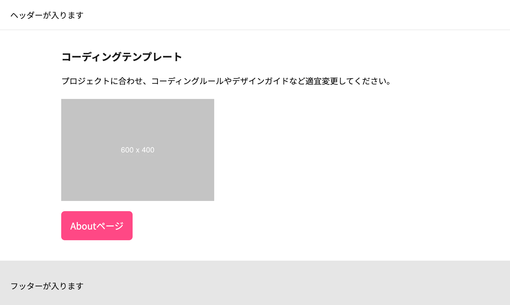
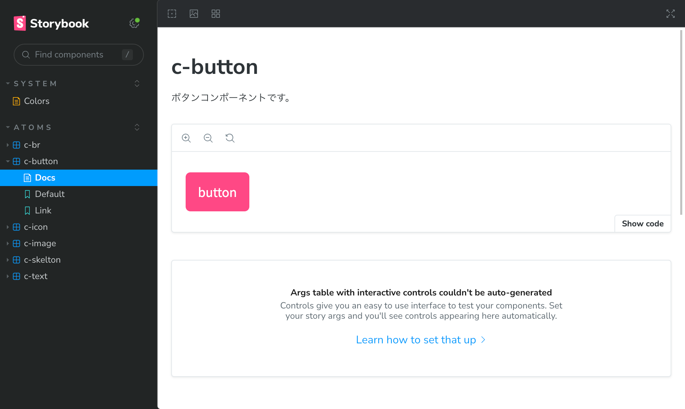

# Cording Template

このリポジトリは、Storybookを使用したプレーンなHTMLコーディングのテンプレートです。





## 開発環境構築

### 1. セットアップ

開発環境のセットアップには、Node.js（v20.9.0 以降）が必要です。

```
nvm install v20.9.0
```

```
nvm use
```

```
yarn install
```

### 2. 開発環境立ち上げ

`src/html`内のhtmlファイルをクリックして直接ブラウザで確認してください。

```
yarn dev
```

### 3. Storybook立ち上げ

コンポーネントはStorybookを起動して追加します。

```
yarn storybook
```

ブラウザで http://localhost:6006 を開いて結果を確認します。

## コーディングルール

- ディレクトリ構造やCSSルールはプロジェクトに合わせて変更してください。
- コンポーネントは[Atomic Design](https://qiita.com/Kazuhiro_Mimaki/items/3d9a8594064aab5119da)で作成してます。

### ディレクトリ構造

| 表記 | 種類 | 概要 |
| --- | --- | --- |
| build | ビルド用 | yarn run buildで生成されます。 |
| src | 開発用 | 開発はこのディレクトリ内で行います。 |
| src/assets | CSS、JavaScript、画像、Webフォント | 静的ファイルを格納します。CSSとJavaScriptでコンパイルしたファイルはこのディレクトリに格納してます。 |
| src/babel | JavaScript | JavaScriptの記述はこのディレクトリで行います。 |
| src/components | JavaScript | Storybookに表示するコンポーネント群です。 |
| src/html | HTML | ページ作成はこのディレクトリで行います。 |
| src/scss | SCSS | スタイルを行うディレクトリです。 |

### CSSルール

- SCSSを利用してます。
- CSS設計は[CASC](https://casc.qwiproject.com/)を採用してますが、プロジェクトに合わせて適宜変更してください。